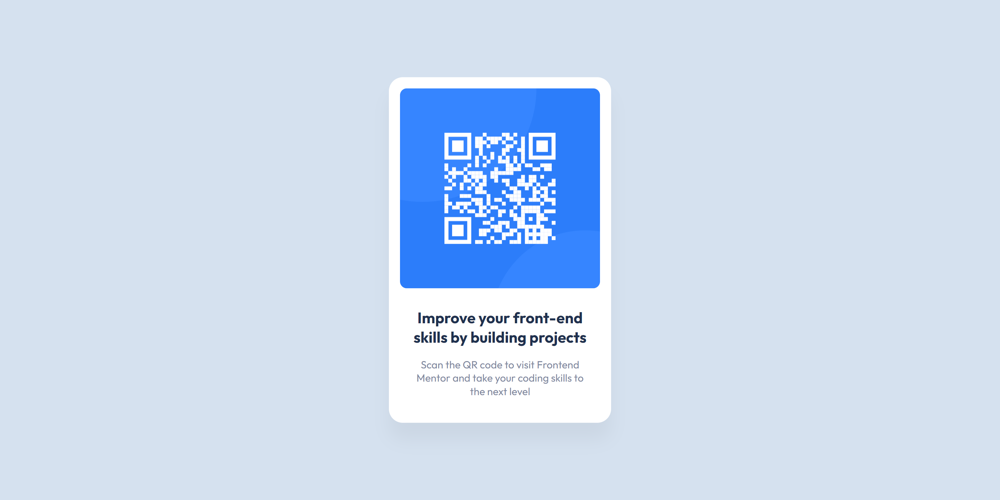
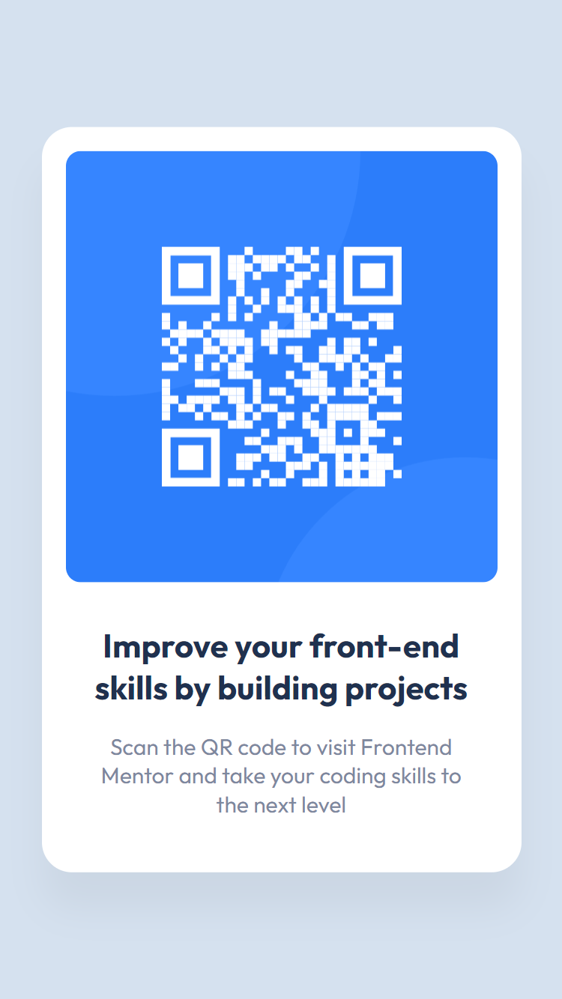

# Frontend Mentor - QR code component solution

This is a solution to the [QR code component challenge on Frontend Mentor](https://www.frontendmentor.io/challenges/qr-code-component-iux_sIO_H). Frontend Mentor challenges help you improve your coding skills by building realistic projects. 

## Table of contents

- [Overview](#overview)
  - [Screenshot](#screenshot)
  - [Links](#links)
- [My process](#my-process)
  - [Built with](#built-with)
  - [What I learned](#what-i-learned)
  - [Continued development](#continued-development)
  - [Useful resources](#useful-resources)
- [Author](#author)
- [Acknowledgments](#acknowledgments)

## Overview
### Screenshot





### Links
- Live Site URL: [Github Pages](https://ivaberiashvili.github.io/qr-code-component/)

## My process
This is my first front-end project using HTML and CSS.
- First I started to bring in all the necessary elements like images and header and paragraph texts
- then I created the shapes and defined the correct spacing using margin and padding
- and finally I used flexbox to align the components in my desired positions. 

### Built with

- Semantic HTML5 markup
- CSS custom properties
- Flexbox

### What I learned

First of all, I learned that glitch.com has a very descriptive name (PUN intended). 
That's why I'm switching to working locally and uploading projects to Github.

I learned, that the image file even inserted inside the div, doesn't respect the div proportions (size; border-radius;etc.).

```html
<div class="card">
  
<div/>

```

```css
.card {
  width: 288px;
  height: 288px;
  border-radius: 10px;
  
}

.img {
  max-width: 100%;
  max-height: 100%;
  border-radius: 10px;
}
```
Here, unless you define **max-width** and **max-height**, the image will retain it's original dimensions and will even need it's separate **border-radius** property.
This was something new to me and I thought that it would work as "layers" and "layer masks" as in Illustrator or Figma.

### Continued development

This is considered as an easy cake to start working with HTML & CSS - easy enough to understand how different components relate to each other.
Logical and effective next steps would be to create other similar project with more complexity - adding more elements and functionality.
In my case, my next project is NFT card (which I'll link here after I finish that).

#
### Useful resources

- [Flexbox Froggy](https://flexboxfroggy.com/) - This really helped me practice in flexbox and solidify my knowledge.
- [Learn to Code HTML & CSS](https://learn.shayhowe.com/html-css/) - If I could bring just one resource with me in the desert, it would probably be this one. Handy tool to review project relevant topics quickly.

## Author
- [Iva](https://github.com/ivaberiashvili)


